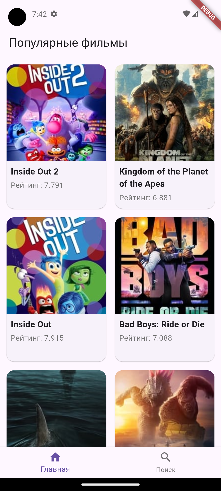

# movies_app

Тестовое задание

Тестовое задание сделанно по [Данной ссылке](https://code-factory.notion.site/fd53b51711fb422897fcaf2b0e6bb20b)

Для лучшей работы лучше использовать [MakeFile](./Makefile). 

env файл лежит в assets .env В идеале будет скрыт, но для тестового так

Скриншоты

  
  
